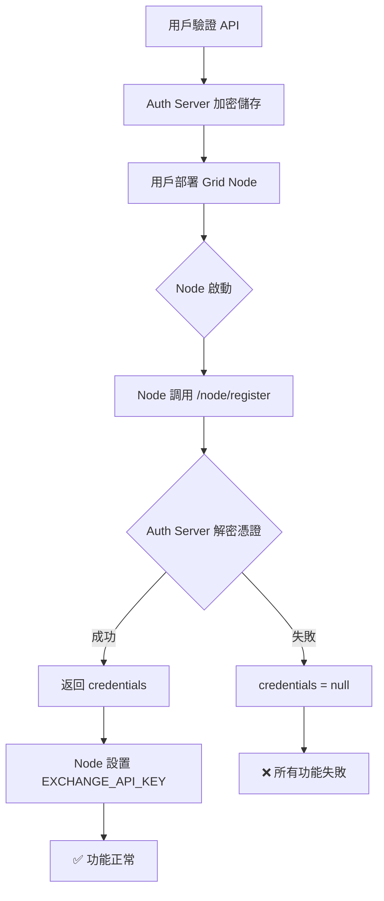

# 🔴 Critical Bug Report: Grid Node Issues

**Date**: 2025-12-18
**Priority**: CRITICAL
**Status**: Under Investigation

---

## 問題總結

| 問題 | 錯誤訊息 | 根本原因 |
| :--- | :--- | :--- |
| 1. API 驗證後無金額顯示 | (無餘額) | Node 未收到 API 憑證 |
| 2. 交易對管理失敗 | `Failed to load symbols` | GlobalConfig 載入失敗 |
| 3. 選幣評分失敗 | `Exchange not configured` | EXCHANGE_API_KEY 環境變數為空 |
| 4. 回測不工作 | (未知) | 可能是數據載入問題 |
| 5. 節點離線 | Node 顯示 offline | 心跳未正確發送 |

---

## 🔍 根本原因分析

### 問題流程圖



### 關鍵代碼路徑

**1. Node 註冊流程** (`grid_node/app/services/bot_manager.py:52-76`)

```python
async def initialize(self) -> Dict[str, Any]:
    if self.auth_client:
        credentials = await self.auth_client.register()
        if credentials:
            # ✅ 正確路徑
            os.environ["EXCHANGE_API_KEY"] = credentials.get("api_key", "")
            os.environ["EXCHANGE_SECRET"] = credentials.get("api_secret", "")
            os.environ["EXCHANGE_PASSPHRASE"] = credentials.get("passphrase", "")
        else:
            # ❌ 問題路徑 - credentials 為 None
            # 此時所有環境變數為空！
```

**2. Auth Server 解密** (`auth_server/app/api/api_v1/endpoints/node.py:96-117`)

```python
# 獲取並解密 API 憑證
credentials = None
if user.credentials:
    try:
        fernet = Fernet(settings.ENCRYPTION_KEY.encode())
        api_key = fernet.decrypt(user.credentials.api_key_encrypted.encode()).decode()
        # ...
    except (InvalidToken, ValueError, Exception) as e:
        # ⚠️ 解密失敗 - credentials 保持 None
        logger.warning(f"Could not decrypt credentials: {e}")
```

---

## 🎯 需要檢查的項目

### 1. Zeabur 環境變數
在 Zeabur Grid Node 服務中確認以下變數：

| 變數名 | 用途 | 必須 |
| :--- | :--- | :---: |
| `AUTH_SERVER_URL` | Auth Server URL (例: `https://your-auth.zeabur.app`) | ✅ |
| `USER_ID` | 用戶 ID (可在 admin 頁面查看) | ✅ |
| `NODE_SECRET` | 與 Auth Server `DEFAULT_NODE_SECRET` 匹配 | ✅ |

### 2. Auth Server 環境變數

| 變數名 | 用途 | 必須 |
| :--- | :--- | :---: |
| `ENCRYPTION_KEY` | API 憑證加密金鑰 (Fernet) | ✅ |
| `DEFAULT_NODE_SECRET` | Node 認證密鑰 | ✅ |

---

## 💡 診斷步驟

### Step 1: 檢查 Grid Node 日誌
在 Zeabur 查看 Grid Node 的日誌，尋找：
```
AuthClient initialized for official server communication
Registering with Auth Server: ...
Successfully registered with Auth Server  ← 應該看到這個
```

如果看到：
```
Running in standalone mode (no AUTH_SERVER_URL)  ← 問題！
Registration failed: ...  ← 問題！
```

### Step 2: 測試 Auth Server 端點
```bash
# 測試註冊端點
curl -X POST https://your-auth-server/api/v1/node/register \
  -H "Content-Type: application/json" \
  -d '{"user_id": "YOUR_USER_ID", "node_secret": "YOUR_SECRET", "node_version": "1.0.0"}'
```

應該返回：
```json
{
  "token": "...",
  "credentials": {
    "api_key": "...",
    "api_secret": "...",
    "passphrase": "..."
  },
  "message": "Node registered successfully"
}
```

如果 `credentials` 為 `null`，問題在 Auth Server 解密。

---

## 🔧 修復建議

### 短期修復 (1-2 小時)

1. **添加環境變數驗證日誌**
   在 `bot_manager.py` 添加啟動時的環境變數檢查

2. **添加心跳失敗重連機制**
   目前心跳失敗後只記錄錯誤，應該嘗試重新註冊

### 中期修復 (1-2 天)

1. **Dashboard 顯示連接狀態**
   前端應該顯示 "credentials received" vs "running standalone"

2. **管理員可查看 Node 狀態**
   在 Admin 面板添加詳細的 Node 連接狀態

---

## 📋 下一步行動

1. [ ] 檢查 Zeabur Grid Node 的環境變數設定
2. [ ] 查看 Grid Node 啟動日誌
3. [ ] 確認 ENCRYPTION_KEY 在 Auth Server 正確設定
4. [ ] 測試 `/node/register` 端點返回值
