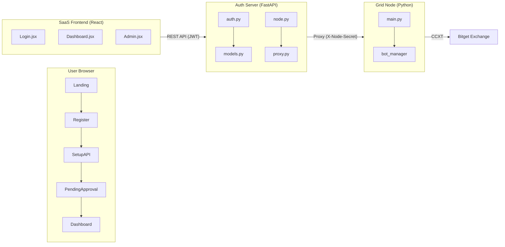

# 📊 Executive Report: Louis AS Grid SaaS Platform

**Report Date**: 2025-12-18
**Report Type**: Year-End Code Review & Launch Readiness Assessment
**Prepared For**: CEO / Stakeholders

---

## 1. Executive Summary

The **Louis AS Grid SaaS Platform** is a web-based automated trading system. After a comprehensive code review of the Frontend, Backend, and Grid Node components, the system is **functionally complete** but requires **final testing and minor fixes** before production launch.

| Metric | Status |
| :--- | :--- |
| **Overall Progress** | ~90% Complete |
| **Estimated Time to Launch** | 2-4 Weeks |
| **Critical Bugs Found** | 0 |
| **High Priority Issues** | 3 |
| **Medium Priority Issues** | 5 |

---

## 2. System Architecture Overview

---

## 3. User Flow Analysis (Traced)

### 3.1 Registration -> Trading Flow

| Step | Action | Frontend | Backend API | Database |
| :--- | :--- | :--- | :--- | :--- |
| 1 | User Registers | `Register.jsx` | `POST /auth/register` | `User.status = 'pending_api'` |
| 2 | Auto-Login | (after register) | `POST /auth/login` | Returns JWT |
| 3 | API Setup | `SetupAPI.jsx` | `POST /auth/verify_api` | Encrypts & stores API keys, `status = 'pending_approval'` |
| 4 | Admin Approves | `Admin.jsx` | `POST /admin/users/{id}/approve` | `status = 'active'` |
| 5 | User Logs In | `Login.jsx` | `POST /auth/login` | Returns token, redirects to Dashboard |
| 6 | Deploy Node | `Deploy.jsx` | `POST /proxy/node/url` | Stores `node_url` |
| 7 | Start Trading | `Dashboard.jsx` | `POST /proxy/grid/start` | Relayed to Grid Node |

**Verdict**: ✅ All major flows are correctly implemented.

---

## 4. Issues Found

### 4.1 High Priority (Must Fix Before Launch)

| ID | Component | Issue | Impact |
| :--- | :--- | :--- | :--- |
| **H-1** | `Register.jsx` | Does not use `AuthContext.register()`. Calls `api.post('/auth/register')` directly. | Code inconsistency. Minor, but could cause future bugs if `AuthContext` logic changes. |
| **H-2** | `schemas/__init__.py` | Password validation requires uppercase letter (`[A-Z]`) and number (`[0-9]`). | Frontend does NOT warn users about these rules, leading to confusing validation errors. |
| **H-3** | `proxy.py` L57 | `DEFAULT_NODE_SECRET` fallback is a hardcoded string `"default"`. | Security Risk. If users don't set a custom secret, all nodes share the same key. |

### 4.2 Medium Priority (Should Fix)

| ID | Component | Issue |
| :--- | :--- | :--- |
| **M-1** | `Dashboard.jsx` | Hardcoded Chinese strings (e.g., `暫停補倉`, `一鍵平倉`). Should use i18n. |
| **M-2** | `Admin.jsx` | Hardcoded English strings (e.g., "Edit User", "No users found"). Should use i18n. |
| **M-3** | `node.py` L245 | "Offline" threshold is 2 minutes, but `proxy.py` allows 10 minutes. Inconsistency. |
| **M-4** | `grid_node/main.py` | CORS is `allow_origins=["*"]`. Should be tightened for production. |
| **M-5** | General | No rate limiting on Grid Node endpoints. Could be abused. |

### 4.3 Low Priority (Nice to Have)

| ID | Component | Issue |
| :--- | :--- | :--- |
| **L-1** | `AuthContext.jsx` | `register` function is defined but never used by `Register.jsx`. Dead code. |
| **L-2** | `models.py` | `InviteCode` table exists but the legacy invite code flow is deprecated. Could be removed. |

---

## 5. Missing Features (For Full Launch)

| Feature | Status | Priority |
| :--- | :--- | :--- |
| **Email Verification** | Not Implemented | Medium |
| **Password Reset** | Not Implemented | Medium |
| **User Notifications (Email)** | Not Implemented (uses `logger.warning` for admin) | Low |
| **Full i18n for all pages** | Partially Complete | High |
| **Terms of Service Consent** | Model Exists (`UserAgreement`), UI Missing | Medium |
| **Automated Tests** | None Found | High |

---

## 6. Launch Readiness Checklist

| Item | Status | Notes |
| :--- | :--- | :--- |
| Core Auth Flow | ✅ | Working |
| API Key Encryption | ✅ | Using Fernet (AES-based) |
| Admin Panel | ✅ | Working |
| Dashboard | ✅ | Working |
| Grid Node Trading | ⚠️ | Needs end-to-end testing with real credentials |
| WebSocket Real-time Updates | ✅ | Implemented |
| i18n (Internationalization) | ⚠️ | Partially done. See M-1, M-2. |
| Security Audit | ⚠️ | H-3, M-4, M-5 need attention. |
| Automated Testing | ❌ | Not found. HIGH RISK. |

---

## 7. Recommended Action Plan

### Week 1: Critical Fixes
1. Fix **H-2**: Add password rules hint to `Register.jsx` (e.g., "Must include uppercase letter and number").
2. Fix **H-3**: Enforce unique `NODE_SECRET` per user or remove the fallback entirely.
3. Fix **M-4**: Restrict CORS on `grid_node` to specific frontend domains.

### Week 2: Testing & i18n
1. Write **integration tests** for the registration and login flow.
2. Complete i18n for Dashboard and Admin panels.
3. End-to-end test of **Grid Node trading** with a Bitget TESTNET account.

### Week 3-4: Soft Launch
1. Deploy to staging environment.
2. Invite 5-10 beta testers.
3. Monitor logs for errors.
4. Collect feedback.

### Post-Launch Roadmap
- Email verification and password reset.
- Mobile responsiveness improvements.
- Advanced trading analytics on Dashboard.

---

## 8. Conclusion

The **Louis AS Grid SaaS Platform** has a solid foundation. The **core user flows** (Registration, Login, API Binding, Trading) are **correctly implemented**. The main gaps are related to **polishing** (i18n), **security hardening** (Node Secret), and **testing** (E2E tests).

**With focused effort over the next 2-4 weeks, the platform can be ready for a public beta launch.**

---

*Report generated by AI Code Review System*
