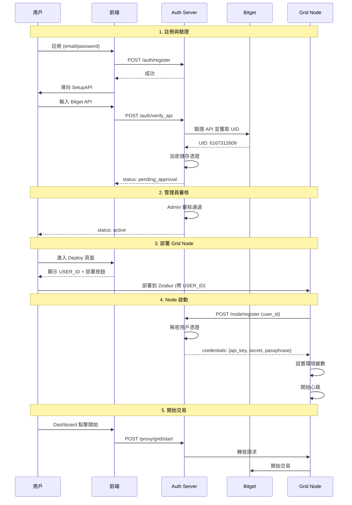

# Louis AS Grid 系統架構文檔

> 本文檔為 AI 開發助手和開發者提供系統架構的完整概覽

---

## 🏗️ 系統組成

```
┌─────────────────────────────────────────────────────────────────────────────┐
│                           Louis AS Grid 系統                                 │
├─────────────────────────────────────────────────────────────────────────────┤
│                                                                             │
│  ┌─────────────────────────────────────────────────────────────────────┐    │
│  │                    官方服務端 (Official Server)                      │    │
│  │                                                                     │    │
│  │   ┌─────────────────┐         ┌─────────────────┐                   │    │
│  │   │  Auth Server    │         │  SaaS Frontend  │                   │    │
│  │   │  (後端 API)     │◄───────►│  (前端網站)     │                   │    │
│  │   │                 │         │                 │                   │    │
│  │   │  FastAPI        │         │  React + Vite   │                   │    │
│  │   │  PostgreSQL     │         │                 │                   │    │
│  │   └─────────────────┘         └─────────────────┘                   │    │
│  │                                                                     │    │
│  │   Zeabur 部署：louisasgrid.zeabur.app (前端)                         │    │
│  │                louisasgrid-api.zeabur.app (後端) [如果分開]          │    │
│  └─────────────────────────────────────────────────────────────────────┘    │
│                                      │                                      │
│                                      │ API 通訊                             │
│                                      ▼                                      │
│  ┌─────────────────────────────────────────────────────────────────────┐    │
│  │                    用戶端 (User Client / Grid Node)                  │    │
│  │                                                                     │    │
│  │   ┌─────────────────┐         ┌─────────────────┐                   │    │
│  │   │  Grid Node      │         │  Trading Core   │                   │    │
│  │   │  (交易節點)     │─────────►│  (交易核心)     │                   │    │
│  │   │                 │         │                 │                   │    │
│  │   │  FastAPI        │         │  MaxGridBot     │                   │    │
│  │   │  WebSocket      │         │  ccxt           │                   │    │
│  │   └─────────────────┘         └─────────────────┘                   │    │
│  │                                                                     │    │
│  │   用戶 Zeabur 部署：xxx.zeabur.app (用戶自己的網域)                   │    │
│  └─────────────────────────────────────────────────────────────────────┘    │
│                                                                             │
└─────────────────────────────────────────────────────────────────────────────┘
```

---

## 📁 目錄結構

```
bitget_as/
├── 【官方服務端】
│   ├── auth_server/              # 後端 API 服務
│   │   ├── app/
│   │   │   ├── api/              # API 端點
│   │   │   │   └── api_v1/
│   │   │   │       └── endpoints/
│   │   │   │           ├── auth.py      # 認證 API (登入/註冊/驗證API)
│   │   │   │           ├── admin.py     # 管理員 API
│   │   │   │           ├── node.py      # Node 通訊 API
│   │   │   │           ├── proxy.py     # 代理到 Grid Node
│   │   │   │           └── users.py     # 用戶 API
│   │   │   ├── core/
│   │   │   │   ├── config.py     # 配置 (SECRET_KEY, ENCRYPTION_KEY)
│   │   │   │   └── security.py   # 加密/JWT
│   │   │   └── db/
│   │   │       ├── models.py     # 資料庫模型
│   │   │       └── session.py    # 資料庫連線
│   │   ├── Dockerfile
│   │   └── zeabur.json
│   │
│   └── saas_frontend/            # 前端網站
│       ├── src/
│       │   ├── pages/
│       │   │   ├── Landing.jsx   # 首頁
│       │   │   ├── Login.jsx     # 登入
│       │   │   ├── Register.jsx  # 註冊
│       │   │   ├── SetupAPI.jsx  # API 設定
│       │   │   ├── Dashboard.jsx # 儀表板
│       │   │   ├── Deploy.jsx    # 部署頁面
│       │   │   ├── Admin.jsx     # 管理後台
│       │   │   └── Settings.jsx  # 設定
│       │   ├── context/
│       │   │   ├── AuthContext.jsx   # 認證狀態
│       │   │   └── I18nContext.jsx   # 多語言
│       │   └── services/
│       │       └── api.js        # API 客戶端
│       ├── Dockerfile
│       └── zeabur.json
│
├── 【用戶端 - Grid Node】
│   ├── grid_node/                # 交易節點
│   │   ├── app/
│   │   │   ├── api/              # 本地 API
│   │   │   │   ├── grid.py       # 交易控制
│   │   │   │   ├── backtest.py   # 回測
│   │   │   │   ├── coin.py       # 選幣
│   │   │   │   ├── symbols.py    # 交易對管理
│   │   │   │   └── websocket.py  # WebSocket
│   │   │   ├── services/
│   │   │   │   ├── auth_client.py    # 與官方通訊
│   │   │   │   └── bot_manager.py    # 機器人管理
│   │   │   ├── core/
│   │   │   │   └── config.py     # 配置
│   │   │   └── main.py           # 主入口
│   │   ├── Dockerfile
│   │   ├── zeabur.json
│   │   └── template.yaml         # Zeabur 模板
│   │
│   └── trading_core/             # 交易核心庫
│       ├── bot.py                # MaxGridBot
│       ├── models.py             # 配置模型
│       └── ...
│
└── 【共用/文檔】
    ├── documentation/            # 文檔
    ├── deploy/                   # 部署腳本
    └── gui/                      # 本地 GUI (PyInstaller)
```

---

## 🌐 URL 和 API 端點

### 官方服務端

| 環境 | 前端 URL | 後端 URL |
| :--- | :--- | :--- |
| 生產環境 | https://louisasgrid.zeabur.app | https://louisasgrid.zeabur.app/api/v1 |
| 開發環境 | http://localhost:5173 | http://localhost:8000/api/v1 |

### 後端 API 端點

| 路徑 | 方法 | 說明 | 認證 |
| :--- | :---: | :--- | :---: |
| `/auth/register` | POST | 用戶註冊 | ❌ |
| `/auth/login` | POST | 用戶登入 | ❌ |
| `/auth/verify_api` | POST | 驗證 Bitget API | ✅ |
| `/users/me` | GET | 獲取當前用戶 | ✅ |
| `/users/bind_node` | POST | 綁定節點 URL | ✅ |
| `/admin/users` | GET | 用戶列表 | ✅ Admin |
| `/admin/users/{id}/approve` | POST | 審核用戶 | ✅ Admin |
| `/node/register` | POST | Node 註冊 | ❌ (用 user_id) |
| `/node/heartbeat` | POST | Node 心跳 | ✅ Node |
| `/proxy/grid/*` | * | 代理到用戶 Node | ✅ |

### Grid Node 本地 API

| 路徑 | 方法 | 說明 |
| :--- | :---: | :--- |
| `/api/v1/health` | GET | 健康檢查 |
| `/api/v1/grid/start` | POST | 開始交易 |
| `/api/v1/grid/stop` | POST | 停止交易 |
| `/api/v1/grid/status` | GET | 獲取狀態 |
| `/api/v1/grid/close-all` | POST | 一鍵平倉 |
| `/api/v1/grid/pause` | POST | 暫停/恢復 |
| `/api/v1/backtest/run` | POST | 執行回測 |
| `/api/v1/coin/scan` | POST | 掃描幣種 |
| `/api/v1/symbols/` | GET/POST | 交易對管理 |
| `/api/v1/ws` | WS | WebSocket 即時更新 |

---

## 🔐 環境變數

### Auth Server (官方後端)

| 變數名 | 必須 | 說明 | 預設值 |
| :--- | :---: | :--- | :--- |
| `DATABASE_URL` | ✅ | PostgreSQL 連線 | - |
| `SECRET_KEY` | ✅ | JWT 簽名密鑰 | INSECURE-... |
| `ENCRYPTION_KEY` | ✅ | Fernet 加密密鑰 | INSECURE-... |
| `DEFAULT_NODE_SECRET` | ✅ | Node 認證密鑰 | - |
| `ADMIN_EMAIL` | ❌ | 預設管理員 | - |
| `ADMIN_PASSWORD` | ❌ | 預設管理員密碼 | - |

### SaaS Frontend (官方前端)

| 變數名 | 必須 | 說明 | 預設值 |
| :--- | :---: | :--- | :--- |
| `VITE_AUTH_API_URL` | ✅ | Auth Server URL | - |

### Grid Node (用戶端)

| 變數名 | 必須 | 說明 | 預設值 |
| :--- | :---: | :--- | :--- |
| `AUTH_SERVER_URL` | ✅ | 官方服務 URL | https://louisasgrid.zeabur.app |
| `USER_ID` | ✅ | 用戶 ID | - |
| `NODE_SECRET` | ✅ | Node 密鑰 | - |
| `CORS_ORIGINS` | ❌ | CORS 來源 | * |

---

## 🔄 資料流程

### 用戶註冊到交易完整流程



---

## 🆔 識別碼說明

| 識別碼 | 格式 | 來源 | 用途 |
| :--- | :--- | :--- | :--- |
| **Bitget UID** | 數字 (6167312609) | Bitget API | ✅ **主要識別碼** - Node 部署 |
| **System User ID** | UUID (a1b2c3d4-...) | 系統生成 | 內部識別（不再用於部署） |
| **Email** | 字串 | 用戶輸入 | 登入識別 |

### ✅ 已實作改進（v2.0）

**現在使用 Bitget UID 作為 Node 部署的主要識別碼**：

**優點**：
- 用戶不需要複製/貼上複雜的 UUID
- Bitget UID 是 10 位數字，更短更直觀
- 不會重複（由 Bitget 保證唯一）

**環境變數**：
```bash
# 新版（推薦）
BITGET_UID=6167312609

# 舊版（仍支援）
USER_ID=a1b2c3d4-e5f6-4a7b-8c9d-0e1f2a3b4c5d
```

---

## 📝 開發注意事項

### 檔案所屬

- `auth_server/` → 官方服務端，只部署一次
- `saas_frontend/` → 官方前端，只部署一次
- `grid_node/` → 用戶端，每個用戶部署一個
- `trading_core/` → 交易核心，被 grid_node 引用

### 常見問題

1. **Node credentials = null**
   - 檢查 ENCRYPTION_KEY 是否一致
   - 確認用戶已完成 API 驗證

2. **Node 離線**
   - 檢查 AUTH_SERVER_URL 是否正確
   - 確認 USER_ID 存在且狀態為 active

3. **CORS 錯誤**
   - Grid Node: 設置 CORS_ORIGINS
   - Auth Server: 確認來源配置
